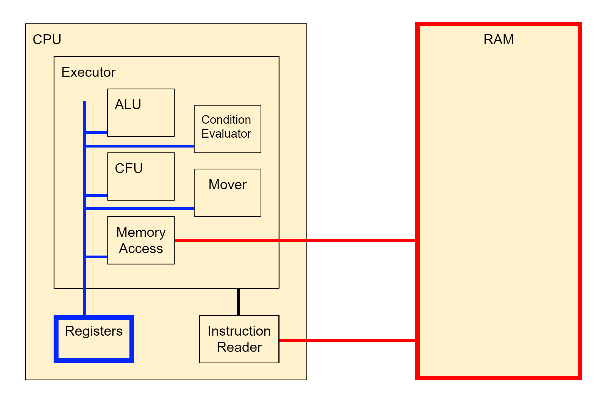

# MyArch32
MyArch32 is a simple, RISC inspired 32-bit CPU architecture designed from the ground up with its own instruction set. It is implemented with SystemVerilog.

- [Registers](1_Registers.md)
- [Instruction Set](2_Instructions.md)
- [Conditional Execution](3_Conditions.md)
- [Instruction Encoding](4_Encoding.md)
- [Arithmetic Logic Unit](5_ALU.md)

CPU end-to-end test example: [Fibonacci Number Generator](myarch32.srcs/sim_1/new/testbench_cpu.sv#L64)
